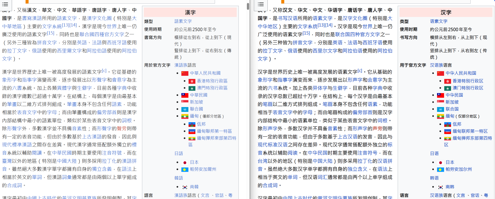

# zh-t2s

一个 Tampermonkey 用户脚本，自动将网页中的**繁体中文**转换为**简体中文**。

[](https://greasyfork.org/zh-CN/scripts/585653-%E7%B9%81%E8%BD%AC%E7%AE%80-zh-t2s)
[](https://github.com/weiningwei/zh-t2s)
[](LICENSE)
[](CHANGELOG.md)

基于 [opencc-js](https://github.com/nk2028/opencc-js)（纯 JavaScript 版 OpenCC）实现，内置 mmseg 短语分词，可依据上下文正确处理一对多映射字词（如 `乾燥→干燥`、`乾坤→乾坤`、`頭髮→头发`、`發展→发展`）。

## 效果演示



*左：转换前的繁体网页　|　右：开启脚本后的简体网页*

## 功能特性

- **全量覆盖**：转换正文、标题、按钮、表单提示（`placeholder`）、`title`、`alt`、`aria-label` 等所有可见文本。
- **上下文感知**：采用 OpenCC `t2s` 词典 + 短语分词，正确解决一对多映射，仅做字形繁简转换，不改变地区用词。
- **动态内容**：通过 `MutationObserver` 监听 DOM 变化，自动转换异步加载或动态插入的节点。
- **不阻塞渲染**：使用 `requestIdleCallback` 分批处理，每帧最多处理 300 个节点，空闲时间耗尽即让出主线程。
- **性能优化**：CJK 预检跳过纯 ASCII 文本；`querySelectorAll` 原生查询属性元素；状态记录避免重复转换。
- **安全跳过**：不修改 `script` / `style` / `noscript` / `textarea` / `input` / `template` / `iframe` 等元素的内容，防止破坏页面功能。
- **无死循环**：通过状态记录区分"自身写入"与"外部写入"，避免转换回写触发观察者导致的无限循环。
- **编辑友好**：跳过当前聚焦的 `contenteditable` 区域，避免打断用户输入。
- **一键开关**：通过油猴菜单项随时切换开关，状态全局持久化，关闭时还原原文。

## 安装

**方式一：Greasy Fork（推荐）**

点击 [Greasy Fork 脚本页](https://greasyfork.org/zh-CN/scripts/585653-%E7%B9%81%E8%BD%AC%E7%AE%80-zh-t2s) 的"安装此脚本"按钮，Tampermonkey 会自动识别并提示安装。后续 Greasy Fork 会定期拉取 GitHub 主分支的更新，无需手动重装。

**方式二：GitHub Raw**

1. 安装 [Tampermonkey](https://www.tampermonkey.net/) 浏览器扩展。
2. 打开 [`zh-t2s.user.js`](zh-t2s.user.js)，点击 Raw 按钮，Tampermonkey 会自动识别并提示安装；或手动新建脚本粘贴内容。
3. 安装后访问任意繁体中文网页即可自动转换。

> 脚本通过 `@require` 从 jsDelivr CDN 加载 `opencc-js@1.4.0`（字典已在构建时打包进库，运行时不再请求字典）。若网络无法访问 CDN，控制台会输出 `[zh-t2s] opencc-js 未加载` 警告且不进行转换。

## 使用

安装后默认开启，访问任意繁体网页即自动转换。

**切换开关**：点击浏览器右上角 Tampermonkey 扩展图标，菜单中可见 `繁→简 转换：✅ 已开启（点击关闭）`，点击即切换。状态全局持久化，所有标签页共享。

**忽略特定元素**：给元素添加 `class="ignore-opencc"`，其子树不会被转换。

## 工作原理

| 模块 | 说明 |
| --- | --- |
| 转换器 | `OpenCC.Converter({ from: 't', to: 'cn' })`，OpenCC 标准 `t2s` 方向 |
| 初始扫描 | `TreeWalker` 收集文本节点；`querySelectorAll` 收集属性元素 |
| CJK 预检 | `HAS_CJK` 正则跳过非中文文本，避免无谓的 OpenCC 调用 |
| 分批调度 | `requestIdleCallback`（兜底 `setTimeout`），每帧最多 `CHUNK_SIZE=300` 个节点 |
| 动态内容 | `MutationObserver` 监听 `childList` / `characterData` / 可转换属性 |
| 死循环防护 | `WeakMap` 记录每个节点最近一次写入值，相同则跳过 |
| 开关还原 | `WeakMap` 记录原始值，关闭时 TreeWalker 遍历还原 |
| 忽略元素 | `script,style,noscript,textarea,input,template,xmp,plaintext,iframe,object,embed,.ignore-opencc` |

## 配置

脚本顶部的常量可按需调整：

```js
const IDLE_TIMEOUT = 2000; // requestIdleCallback 兜底超时（ms）
const CHUNK_SIZE   = 300;  // 每个空闲帧最多处理的节点数
```

- **限定站点**：修改元数据 `@match`，例如 `@match *://*.wikipedia.org/*`。
- **不在 iframe 中运行**：在元数据中添加 `@noframes`。

## 许可证

MIT

## 链接

- [Greasy Fork 脚本页](https://greasyfork.org/zh-CN/scripts/585653-%E7%B9%81%E8%BD%AC%E7%AE%80-zh-t2s) — 在线安装与自动更新
- [GitHub 仓库](https://github.com/weiningwei/zh-t2s) — 源码与问题反馈
- [更新日志](CHANGELOG.md) — 版本变更记录
- [问题反馈](https://github.com/weiningwei/zh-t2s/issues) — Bug 报告与功能建议
